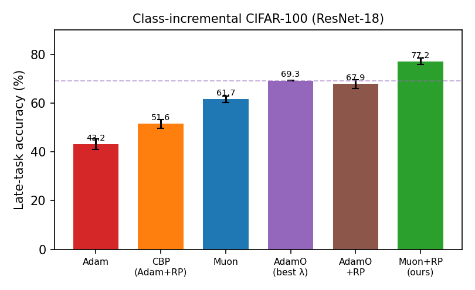
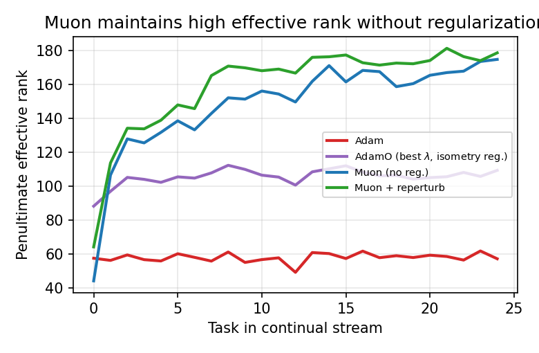
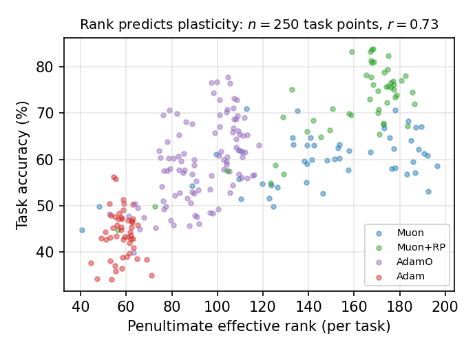
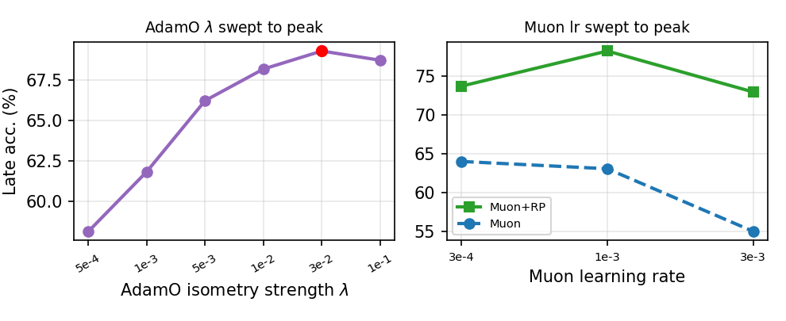

# PLAST — Orthogonalizing Optimizers & the Mechanism of Plasticity

<p align="center">
  <b>Representational Rank, Not Kernel Conditioning, Predicts Plasticity:</b><br/>
  <i>Why Orthogonalizing Optimizers Preserve Plasticity in Continual Learning</i>
</p>

<p align="center">
  
  
  
  
</p>

---

## TL;DR

Neural networks trained continually on a stream of tasks progressively **lose the ability to learn new ones** — *loss of plasticity*. The ICML'26 state of the art, **AdamO**, blames the conditioning of the empirical NTK and adds a *dynamical-isometry* regularizer to Adam.

We revisit this with the modern **Muon** optimizer (which orthogonalizes its update every step). Two findings:

1. 🟢 **Empirics:** A Muon base **+ unit reperturbation (RP)** beats AdamO **and every plasticity baseline we tried**, across 3 benchmarks, 3 network widths, and standard *and* recurring-task protocols — in both online **and held-out test** accuracy.
2. 🔬 **Mechanism (honest):** It is **not** for the reason AdamO predicts. Measuring the NTK directly, **AdamO is the *best*-conditioned method yet loses**. We then *falsify* representational rank too (AdamO matches Muon's rank at every layer), and **localize** the benefit to **mid-to-late backbone optimization**.

<p align="center">
  
</p>
<p align="center"><i>Continual CIFAR-100 (ResNet-18). Muon+RP (green) beats AdamO at its best-tuned isometry strength and every baseline. CBP-style reperturbation on Adam (orange) does not close the gap — the orthogonalizing optimizer is the cause.</i></p>

---

## 📊 Headline results

**Continual CIFAR-100** (ResNet-18, recurring random 10-way tasks, late-task accuracy %, n=5):

| Method | Online acc. | Held-out test |
|---|---:|---:|
| **Muon + RP (ours)** | **77.2 ± 1.3** | **72.6 ± 2.4** |
| AdamO (best λ) | 69.3 ± 0.2 | 66.9 ± 1.2 |
| AdamO (best λ) + RP | 67.9 ± 1.8 | 64.7 |
| CBP | 51.6 ± 1.8 | — |
| L2-init / ReDo / SGD / AdamW | 48.9 / 44.2 / 42.9 / 42.8 | — |
| Adam | 43.2 ± 2.3 | 50.4 |
| shrink-and-perturb | 24.8 ± 0.7 | — |

**Δ Muon+RP vs AdamO+RP = +9.3 (t = 8.4).** Holds across benchmarks and scales:

| Benchmark / scale | Muon-based | AdamO-based | Δ |
|---|---:|---:|---:|
| CIFAR-100 (ResNet-18, w32) | **77.2** | 67.9 | +9.3 |
| CIFAR-10 (binary tasks) | **84.6** | 81.6 | +3.0 |
| permuted-MNIST (MLP) | **70.0** | 65.8 | +4.2 |
| **Standard disjoint Split CIFAR-100** | **64.7** | 58.7 | +6.0 |
| ResNet-18 width 64 / 128 | **80.5 / 79.2** | 70.7 / 71.0 | +9.8 / +8.2 |

---

## 🔬 The mechanism — measured, not assumed

### 1. NTK conditioning is *not* the cause (a clean dissociation)

| Method | Late acc. | NTK cond. ↓ | NTK eff-rank ↑ | Repr. rank |
|---|---:|---:|---:|---:|
| Muon + RP | **78.3** | 47k | 15.3 | **175** |
| Muon | 62.4 | 21k | 17.0 | 167 |
| **AdamO (best)** | 68.5 | **3.4k** | **17.4** | 107 |
| Adam | 45.3 | 694k | 2.7 | 59 |

AdamO optimizes for NTK conditioning and **wins on it** — yet loses on plasticity. ❌ Kernel conditioning is not the operative variable.

### 2. Representational rank *correlates* but is not the simple cause

<p align="center">
  
  
</p>
<p align="center"><i>Left: penultimate effective rank over the task stream — Adam collapses, Muon stays high. Right: across 250 (method, seed, task) points, rank correlates with accuracy (r = 0.73; within-method 0.44).</i></p>

But two controls temper this:
- A **bottleneck** capping the head-visible rank to 8 does **not** erase the +10 gap → final-layer dimensionality is not causal.
- **Per-block** analysis shows AdamO and Muon have **near-identical feature rank at every layer** (l1–l4) yet very different accuracy → rank does not separate the *winners*; it mainly separates the collapsed optimizer (Adam) from the rest.

### 3. ✅ Where the benefit lives — localizing to the backbone

Applying Muon to **subsets of blocks** (Adam elsewhere, RP fixed) and measuring how much of the +27.6 gain each recovers:

| Muon on | early (stem,l1,l2) | mid (l2,l3) | late (l3,l4,fc) | all |
|---|---:|---:|---:|---:|
| **% of gain recovered** | 38% | **71%** | **72%** | 100% |

The advantage is an optimization effect **concentrated in the mid-to-late backbone** — exactly where the plasticity literature finds loss of plasticity to concentrate.

---

## ⚖️ Honest scope (we report the boundaries up front)

- **Plain Muon needs RP** to beat a strongly-regularized AdamO on deep nets; the controlled claim is the matched `+RP` comparison.
- The effect **does not transfer to value-based RL** (DQN on permuted CartPole): Muon ties Adam/CBP.
- A **KAN** pilot is *worse* than a plain MLP for plasticity (lower rank, lower late accuracy).
- The precise operative variable inside the mid-to-late backbone **remains open** — across 8 mechanism probes it is *not* NTK conditioning and *not* representational rank.

<p align="center">
  
</p>
<p align="center"><i>Fairness: AdamO's λ and Muon's learning rate are each swept to their optimum, so the gap is not a tuning artifact.</i></p>

---

## 📁 Repository structure

```
PLAST/
├── README.md            # this file
├── assets/              # figures used in this README
├── paper/               # main.tex / main.pdf (AAAI format) + figures + style files
├── code/                # all experiment scripts + run_*.sh drivers
│   ├── plast_resnet.py  # ★ main: ResNet-18 continual learning + all mechanism probes
│   ├── plast_mnist.py   # permuted / class-incremental MLP
│   ├── plast_rl.py      # DQN continual RL
│   ├── plast_kan.py     # KAN-vs-MLP plasticity pilot
│   └── aggregate.py     # aggregation + Welch t-tests
├── results/             # per-seed JSON for every experiment + SCOREBOARD.md
└── docs/                # cover letter, reproducibility checklist, review history
```

## ▶️ Quickstart

```bash
# Main comparison on continual CIFAR-100 (point --data at cifar-100-python)
python code/plast_resnet.py --method ptc_muon --no_vreset --reperturb_frac 0.05 \
    --dataset cifar100 --classes_per_task 10 --n_tasks 25 --epochs_per_task 2 \
    --width 32 --seed 0 --data /path/to/cifar-100-python --out out/muonRP_s0.json

python code/plast_resnet.py --method adamo --adamo_lambda 3e-2 \
    --dataset cifar100 --classes_per_task 10 --n_tasks 25 --epochs_per_task 2 \
    --width 32 --seed 0 --data /path/to/cifar-100-python --out out/adamo_s0.json

python code/aggregate.py out
```

`plast_resnet.py` flags: `--method {adam,muon,ptc_muon,adamo,cbp,redo,l2init,sgd,adamw,shrink_perturb}`,
`--muon_blocks {early,mid,late,all}` (layer localization), `--bottleneck/--mid_bottleneck` (causal rank caps),
`--log_ntk` (NTK + per-block rank), `--log_rank`, `--log_adapt` (adaptation speed), `--disjoint` (standard class-incremental).

**Requirements:** `torch`, `numpy` (+ `gymnasium` for RL). Single GPU; the full study (>300 runs) completes in a few hours.

## 📜 Citation

```bibtex
@misc{plast2026,
  title  = {Representational Rank, Not Kernel Conditioning, Predicts Plasticity:
            Why Orthogonalizing Optimizers Preserve Plasticity in Continual Learning},
  author = {ITADN-Lab},
  year   = {2026},
  note   = {https://github.com/ITADN-Lab/PLAST}
}
```

## License

MIT.
